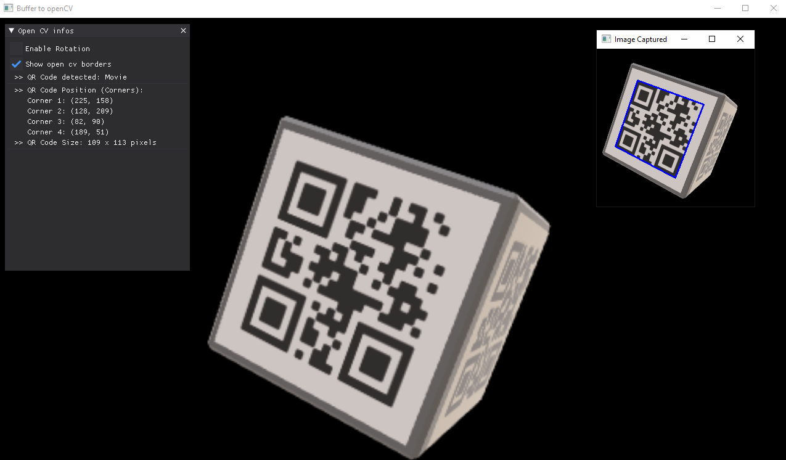

# HARFANG® Advanced Tutorials

These **tutorials** detail an advanced usage of the HARFANG API in **Python** and **Lua**. The aim is to demonstrate the combination of HARFANG with advanced systems found in the Lua or Python ecosystem, in terms of [AI](https://pypi.org/project/opencv-python/), [multitasking](https://en.wikipedia.org/wiki/Coroutine), etc.

## Screenshots
* Framebuffer to [OpenCV](https://pypi.org/project/opencv-python/) (Python only)



## To run the tutorials : 

1. Download or clone this repository to your computer _(eg. in `d:/advanced-tutorials-hg2`)_.
2. Download _assetc_ for your platform from [here](https://harfang3d.com/releases) to compile the tutorial resources.
3. Drag and drop the tutorial resources folder on the assetc executable **-OR-** execute assetc passing it the path to the tutorial folder _(eg. `assetc d:/advanced-tutorials-hg2/resources`)_.


After the compilation process finishes, you will see a `resources_compiled` folder next to the tutorials resources folder.

You can now execute the tutorials from the folder you unzipped them to.

```bash
D:\tutorials-hg2>python scene_coroutine.py
```
or
```bash
D:\tutorials-hg2>lua scene_coroutine.lua
```

Alternatively, you can open the tutorial folder using [Visual Studio Code](https://code.visualstudio.com/) and use the provided debug targets to run the tutorials.

**If you want to know more about HARFANG**, please visit the [official website](https://www.harfang3d.com).

You can also visit the [Harfang3D-Tutorials](https://github.com/harfang3d/tutorials-hg2) if you want to see more.
